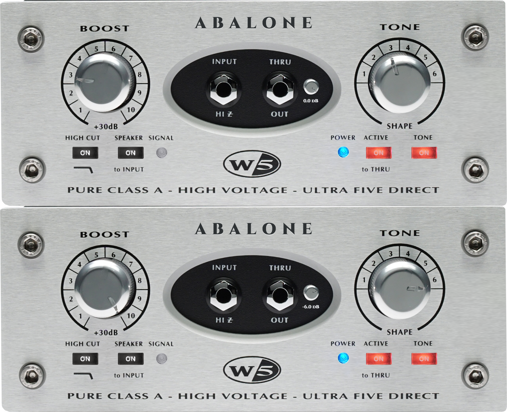
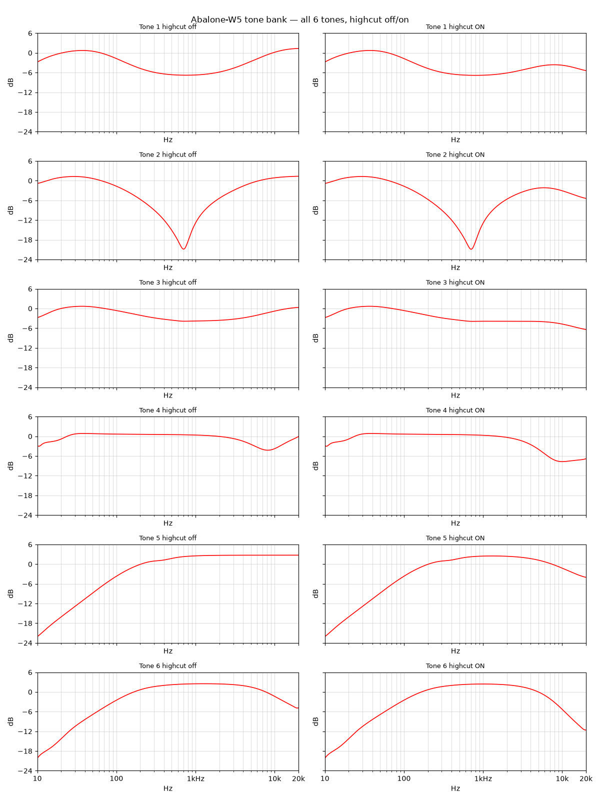

# Abalone W5

[](https://github.com/Sakdinat2548/Abalone-W5/actions/workflows/ci.yml)
[](https://www.gnu.org/licenses/agpl-3.0)

U5-inspired clean DI — free VST3 (Windows, macOS, Linux) + AU (macOS, for Logic).
Windows is host-tested (Sonar, Reaper); macOS/Linux builds are CI-tested only.



Inspired by the Avalon U5. Not affiliated with or endorsed by Avalon Design.

[Download latest release](https://github.com/Sakdinat2548/Abalone-W5/releases/latest)

## What it is

Clean DI signal path — `Boost -> DC-block -> Tone -> Color -> DC-block -> HighCut -> Trim -> Tilt + LED` —
built with JUCE 8 biquads/gain only. Ships as VST3 (Windows, macOS, Linux)
plus an AU component (macOS, for Logic — auval-validated). 0 dBFS = +24 dBu
(hardware max in); +4 dBu nominal = −20 dBFS (see `analysis/LEVELS.md`).

## Controls

| Control | Values |
|---|---|
| Boost | 1–10 stepped, 3 dB/step (~+3 to +30 dB), default 1 |
| Tone | Bypass + 1–6, default Tone 3 (10 ms xfade on switch) |
| TONE button | Tone in/out (default in) |
| ACTIVE button | Active/Thru relay-style bypass, bit-transparent (default active; DAW bypass follows it, and also silences on its own) |
| HighCut | On/off, −3 dB at 8 kHz, 1-pole min-phase (default off) |
| TRIM | Cut-only −30..0 dB (default 0) |
| SIGNAL LED | Signal-present at −2 dBFS, pre-trim tap (follows Boost staging, unaffected by TRIM) |
| OS mini-knob | 1x/2x/4x oversampling on the Color stage only, default 1x (exact FIR delay 0/40/60 samples via `setLatencySamples`) |

Editor is aspect-locked, corner-drag resizable 1x–2x (748x304 to 1496x608).

## Build from source

From repo root, `cmd` (NOT a MinGW shell — JUCE hard-rejects MinGW gcc on PATH, so force `CC=cl`/`CXX=cl`):

```bat
call "C:\Program Files (x86)\Microsoft Visual Studio\2019\BuildTools\Common7\Tools\VsDevCmd.bat" -arch=x64 && set CC=cl && set CXX=cl && C:\msys64\ucrt64\bin\cmake.exe -B build -G Ninja -DCMAKE_BUILD_TYPE=Release -DCMAKE_MAKE_PROGRAM=C:\msys64\ucrt64\bin\ninja.exe
cmake --build build
ctest --test-dir build --output-on-failure
```

Requires MSVC 2019 BuildTools, JUCE 8.0.15 (FetchContent), C++17. See `AGENTS.md`.

Editing the code (clangd/Zed): the editor resolves all headers only after
the one-time IDE setup in `AGENTS.md` ("IDE (clangd) setup") — configure
plus the assets-target build, otherwise `BinaryData.h` reads as missing
from the first open.

## Install

- VST3: copy `Abalone-W5.vst3` to `%COMMONPROGRAMFILES%/VST3`, then rescan plug-ins in your DAW. This is the product; releases ship the VST3 on every OS (plus AU on macOS).
- AU (macOS zip only, for Logic): copy `Abalone-W5.component` to `~/Library/Audio/Plug-Ins/Components` (or the system location), then rescan in Logic.
- Standalone (dev testing only, not shipped): run the locally built `Abalone W5.exe` directly.

## Validation

- Per-stage CTest gates (`tests/`): bypass flat 20 Hz–15 kHz ±0.5 dB (±0.1 at 1 kHz; the owned 5 Hz −3 dB DC-block corner is by design), tones fit to digitized curves within ±0.5 dB, boost +3 dB/step with no clip, highcut −3 dB @ 8 kHz, THD ~0.38% at +10 dB stage level.
- Tone shapes cross-checked against IR measurements ([tone curves](docs/tone-curves.png), [signal flow](docs/signal-flow.png)).


- Passes pluginval at strictness 5 and 10 (logs: `docs/pluginval/strictness-5.txt`, `docs/pluginval/strictness-10.txt`).
- AU passes Apple's `auval` on every CI/release macOS leg (state round-trip included).

## License

AGPLv3 — see `LICENSE`. Author: Sakdinat2548.
